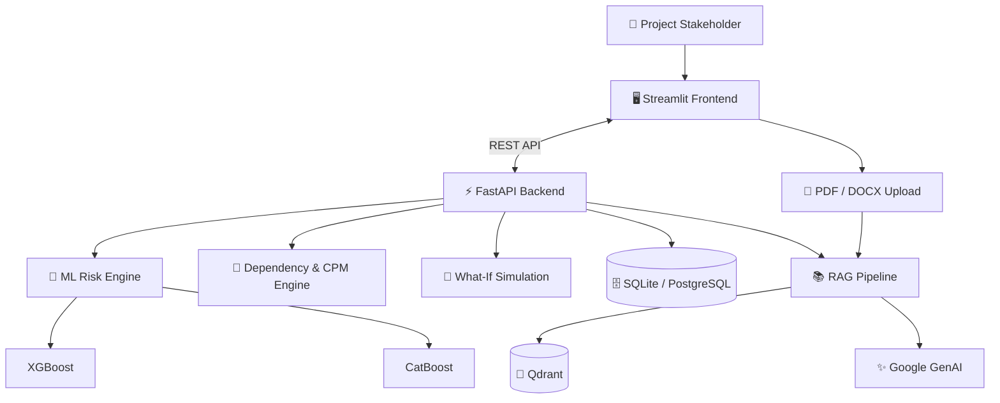

# 🧠 AI Project Intelligence & Risk Advisor

An end-to-end intelligent project management platform that uses **Machine Learning, Graph Analysis, What-If Simulation, and Generative AI** to predict project risks, analyze dependencies, forecast schedules, and provide actionable insights.


---

## 🚀 Key Features

* 🔐 **Role-Based Access** — IT and Non-IT project workflows
* 🤖 **AI Risk Prediction** — XGBoost & CatBoost risk forecasting
* 📅 **Schedule Intelligence** — deadline and milestone analysis
* 🔗 **Dependency Analysis** — NetworkX and Critical Path Method
* 🔮 **What-If Simulation** — test resource and schedule scenarios
* 📚 **RAG Assistant** — AI chatbot for PDF/DOCX project documents
* 📊 **Interactive Dashboard** — Streamlit-based project intelligence

---

## 🏗️ System Architecture



---

## 🔄 How It Works

```text
Project Data
     ↓
FastAPI Backend
     ↓
 ┌──────────────┬──────────────┬──────────────┐
 │              │              │              │
 ▼              ▼              ▼              ▼
ML Risk      Dependency     What-If        RAG AI
Prediction   & CPM Analysis  Simulation     Assistant
 │              │              │              │
 └──────────────┴──────────────┴──────────────┘
                       ↓
              Project Intelligence
                       ↓
              Streamlit Dashboard
```

---

## 🛠️ Technology Stack

| Layer          | Technologies                           |
| -------------- | -------------------------------------- |
| Frontend       | Streamlit, Requests                    |
| Backend        | FastAPI, Pydantic, SQLAlchemy, Alembic |
| Database       | SQLite, PostgreSQL                     |
| ML             | Scikit-learn, XGBoost, CatBoost        |
| Graph Analysis | NetworkX                               |
| GenAI / RAG    | Google GenAI, Qdrant                   |
| Documents      | PyPDF, docx2txt                        |
| Server         | Uvicorn                                |

---

## 📁 Project Structure

```text
AI_project/
└── final_project/
    ├── app.py
    ├── requirements.txt
    ├── start_all.bat
    │
    └── backend/
        ├── app/
        │   ├── api/
        │   ├── models/
        │   ├── schemas/
        │   ├── services/
        │   └── ml/
        ├── scripts/
        ├── tests/
        └── alembic/
```

---

## ⚙️ Installation

### 1. Create Environment

```bash
conda create -n project_ai python=3.11 -y
conda activate project_ai
```

### 2. Install Dependencies

```bash
cd AI_project/final_project
pip install -r requirements.txt
```

### 3. Configure `.env`

```env
GOOGLE_API_KEY=your_google_api_key
USE_CLOUD_AI=true
QDRANT_URL=your_qdrant_url
QDRANT_API_KEY=your_qdrant_api_key
```

### 4. Initialize Backend

```bash
cd backend
alembic upgrade head
set PYTHONPATH=.

python scripts/generate_training_data.py
python -m app.ml.train
python scripts/seed.py
```

---

## ▶️ Run the Application

### Backend

```bash
python -m uvicorn app.main:app --host 127.0.0.1 --port 8000 --reload
```

### Frontend

Open another terminal:

```bash
cd AI_project/final_project
conda activate project_ai
python -m streamlit run app.py
```

### 🌐 URLs

| Service       | URL                           |
| ------------- | ----------------------------- |
| 🖥️ Streamlit | `http://localhost:8501`       |
| ⚡ FastAPI     | `http://127.0.0.1:8000`       |
| 📘 Swagger    | `http://127.0.0.1:8000/docs`  |
| 📖 ReDoc      | `http://127.0.0.1:8000/redoc` |

---

## 🧪 Testing

```bash
cd backend
pytest
```

---

## 🐳 Docker

```bash
docker compose up --build
```

---

## 🎯 Project Goal

> **Predict risks early, understand project dependencies, simulate possible outcomes, and provide AI-powered recommendations for better project decisions.**

### ⭐ Predict • Analyze • Simulate • Advise
