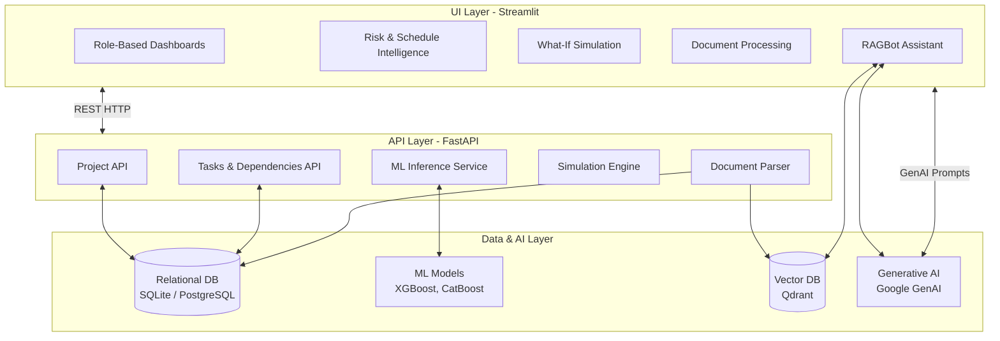

#  AI Project Intelligence & Risk Advisor


An integrated, end-to-end platform for predicting, analyzing, and mitigating project risks using Machine Learning and Generative AI. This platform empowers both IT and Non-IT stakeholders with advanced schedule forecasting, what-if simulations, dependency analysis, and an intelligent RAG-powered chatbot.

---

##  Key Features

- **Role-Based Access**: Dedicated workflows and dashboards for IT and Non-IT users.
- ** AI Risk Prediction**: Leverages XGBoost and CatBoost to forecast project risks and project health.
- ** Schedule Intelligence**: Deadline forecasting, milestone tracking, and delay impact analysis.
- ** Dependency Tracking**: Critical path analysis using NetworkX to visualize bottlenecks.
- ** What-If Simulation**: Safely test different scenarios (e.g., budget cuts, resource constraints) without affecting production data.
- ** RAG Assistant**: A GenAI-powered chatbot (Google GenAI + Qdrant) that acts as an intelligence advisor over uploaded project documents (PDF, DOCX).
- ** Interactive Dashboard**: Built with Streamlit for a rich, dynamic user experience.

---

##  System Architecture

The architecture is decoupled into a reactive frontend, a robust API backend, machine learning predictive models, and a Generative AI intelligence layer.



---

##  Technology Stack

- **Frontend**: Streamlit, Requests
- **Backend**: FastAPI, Pydantic, SQLAlchemy, Alembic, Uvicorn
- **Database**: SQLite (default for local execution), PostgreSQL supported
- **Machine Learning**: Scikit-Learn, XGBoost, CatBoost, NetworkX, Pandas, NumPy
- **Generative AI / NLP**: Google GenAI, Qdrant (Vector Database), PyPDF, docx2txt

---

##  Getting Started (Windows + Anaconda)

Follow these steps to run the application locally on your Windows machine.

### 1. Create Environment
First, create and activate a new Conda environment.
```bat
conda create -n project_ai python=3.11 -y
conda activate project_ai
```

### 2. Install Dependencies
Install all required packages from `requirements.txt`.
```bat
pip install -r requirements.txt
```

### 3. Quick Start (All-in-One)
You can use the provided batch script to start both the backend and frontend seamlessly. The script activates the `.venv` or conda environment automatically and spawns two processes.
```bat
start_all.bat
```
*Alternatively, you can run them in separate terminals as shown below.*

### 4. Start Backend (Manual)
Open **Anaconda Prompt 1**:
```bat
cd backend
set PYTHONPATH=.
python -m uvicorn app.main:app --host 127.0.0.1 --port 8000 --reload
```
- API Base URL: `http://127.0.0.1:8000`
- API Documentation (Swagger): `http://127.0.0.1:8000/docs`

### 5. Start Frontend (Manual)
Open **Anaconda Prompt 2**:
```bat
conda activate project_ai
python -m streamlit run app.py
```
- Streamlit UI: `http://localhost:8501`

---

##  Recreate Demo Data & ML Models

If you want to clear the database, regenerate synthetic training data, and retrain the ML models, run the following commands from the `backend` directory:

```bat
cd backend
set PYTHONPATH=.

# 1. Generate training data
python scripts/generate_training_data.py

# 2. Train ML models (XGBoost/CatBoost)
python -m app.ml.train

# 3. Seed demo project in the database
python scripts/seed.py
```
*Note: `seed.py` will clear the existing demo project and recreate it.*

---

##  Environment Variables

For the Generative AI and RAG features to work, you may need to configure a `.env` file in the root directory.

```ini
GOOGLE_API_KEY=your_google_api_key_here
```
